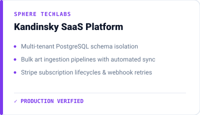
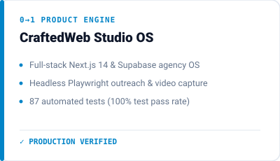

<picture>
  <source media="(prefers-color-scheme: dark)" srcset="assets/hero-v2-dark.svg">
  
</picture>

<picture>
  <source media="(prefers-color-scheme: dark)" srcset="assets/terminal-v2-dark.svg">
  
</picture>

### Currently

Backend Developer at **Sphere Techlabs** (Jun 2024 – Present), building core backend architecture for **Kandinsky** (multi-tenant artwork SaaS & gallery commerce), and Founder at **CraftedWeb Studio**.

### Systems I've Built

  <a href="https://kandinsky.app" target="_blank">
    <picture>
      <source media="(prefers-color-scheme: dark)" srcset="assets/card-kandinsky-v2-dark.svg">
      
    </picture>
  </a>
  <a href="https://crafted-web-studio.vercel.app/" target="_blank">
    <picture>
      <source media="(prefers-color-scheme: dark)" srcset="assets/card-craftedweb-v2-dark.svg">
      
    </picture>
  </a>

### Core Stack

<picture>
  <source media="(prefers-color-scheme: dark)" srcset="assets/stack-v2-dark.svg">
  
</picture>

### Connect

<a href="https://portfolio-shubham-850f.vercel.app/">
  <picture>
    <source media="(prefers-color-scheme: dark)" srcset="assets/btn-portfolio-dark.svg">
    
  </picture>
</a>
&nbsp;
<a href="https://crafted-web-studio.vercel.app/">
  <picture>
    <source media="(prefers-color-scheme: dark)" srcset="assets/btn-studio-dark.svg">
    
  </picture>
</a>
&nbsp;
<a href="https://www.linkedin.com/in/shubham-kevadiya/">
  <picture>
    <source media="(prefers-color-scheme: dark)" srcset="assets/btn-linkedin-dark.svg">
    
  </picture>
</a>
&nbsp;
<a href="mailto:shubhamekevadiya681@gmail.com">
  <picture>
    <source media="(prefers-color-scheme: dark)" srcset="assets/btn-email-dark.svg">
    
  </picture>
</a>
